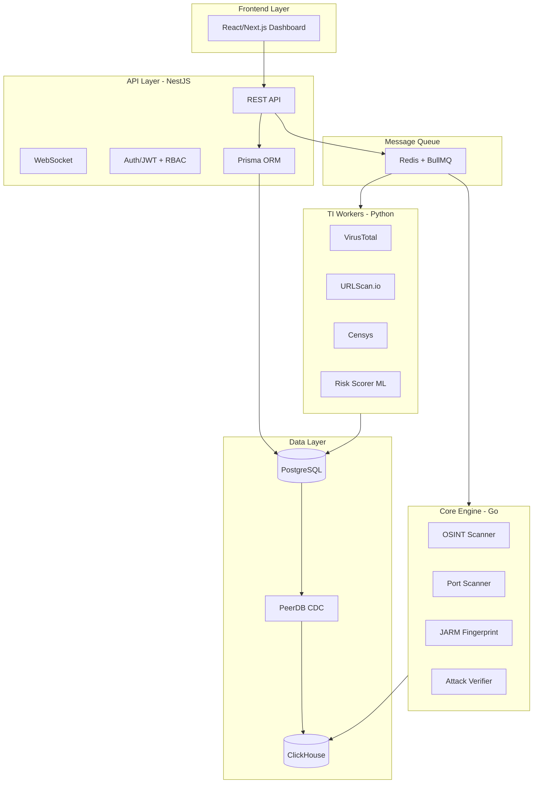

# ASM-Hawk Architecture

Kiến trúc kỹ thuật Hybrid cho nền tảng ASM-Hawk.

## Tech Stack

| Layer | Technology | Purpose |
|-------|------------|---------|
| **Frontend** | React/Next.js | Web Dashboard |
| **API** | NestJS + Prisma | REST API, WebSocket, RBAC |
| **Core Engine** | Go | Port Scanner, JARM, Attack Verify |
| **TI Workers** | Python | VirusTotal, Censys, ML Scoring |
| **Job Queue** | Redis + BullMQ | Async job scheduling |
| **Primary DB** | PostgreSQL | Transactional data |
| **Analytics DB** | ClickHouse | Time-series analytics |

## System Architecture

## Inter-Service Communication

| Pattern | Protocol | Use Case |
|---------|----------|----------|
| API → Workers | Redis Queue (BullMQ) | Async job scheduling |
| Workers → API | Redis Pub/Sub | Real-time notifications |
| Go ↔ NestJS | gRPC (optional) | High-perf sync calls |
| PostgreSQL → ClickHouse | CDC (PeerDB) | Real-time data sync |

## Key Libraries

| Component | Library | Purpose |
|-----------|---------|---------|
| Go Port Scanner | `gopacket`, `net` | SYN/TCP scans |
| Go JARM | `hdm/jarm-go` | TLS fingerprinting |
| Python TI | `vt-py`, `censys-python` | API clients |
| DB Sync | PeerDB / ClickPipes | CDC replication |

## Related Docs
- [Database](Database.md)
- [Workflow](Workflow.md)
- [Sequence](Sequence.md)
