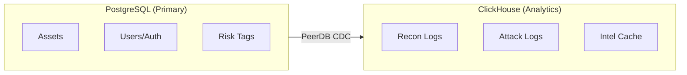

# ASM-Hawk Database Architecture

Kiến trúc Database cho nền tảng ASM-Hawk.

## Tổng quan

Hệ thống sử dụng **Hybrid Database Architecture**:
- **PostgreSQL**: Primary DB cho transactional data
- **ClickHouse**: Analytics DB cho time-series logs
- **PeerDB CDC**: Real-time sync từ PostgreSQL → ClickHouse

## Database Schema

### Core Tables (PostgreSQL)

| Table | Mô tả | Đặc điểm |
|-------|-------|----------|
| `assets` | Domain, IP, IP Owner | Read-heavy, indexed |
| `recon_results` | Port scan, services, vulns | Partitioned by month |
| `attack_results` | Exploit verification logs | Partitioned by month |
| `external_intel` | TI API responses (cached 24h) | TTL-based cleanup |
| `risk_tags` | C2-Suspected, JARM-Match | Key-value lookups |
| `users` | User accounts + RBAC | Row-Level Security |
| `search_history` | User search logs | Full-text indexed |

### Retention Policy

| Table | Strategy | Retention |
|-------|----------|-----------|
| `recon_results` | Monthly partitions | 12 months |
| `attack_results` | Monthly partitions | 24 months |
| `external_intel` | TTL cleanup | 24 hours |

## Key Features

### Full-text Search
- PostgreSQL `tsvector` + `pg_trgm` extension
- Wildcard search, IP range, JSONB queries

### Caching
- Intel API responses cached 24h trong `external_intel`
- Redis cho session & job queue

### Multi-tenant
- Row-Level Security (RLS) enabled
- User isolation per organization

## Storage Estimation

| Entity | Records/Month | Monthly Storage |
|--------|---------------|-----------------|
| Assets | 50,000 | ~100 MB |
| Recon Results | 500,000 | ~500 MB |
| Attack Results | 50,000 | ~250 MB |
| External Intel | 100,000 | ~1 GB (cached) |
| **Total** | | **~2 GB/month** |

## Related Docs
- [Architecture](Architecture.md)
- [Workflow](Workflow.md)
- [Sequence](Sequence.md)
