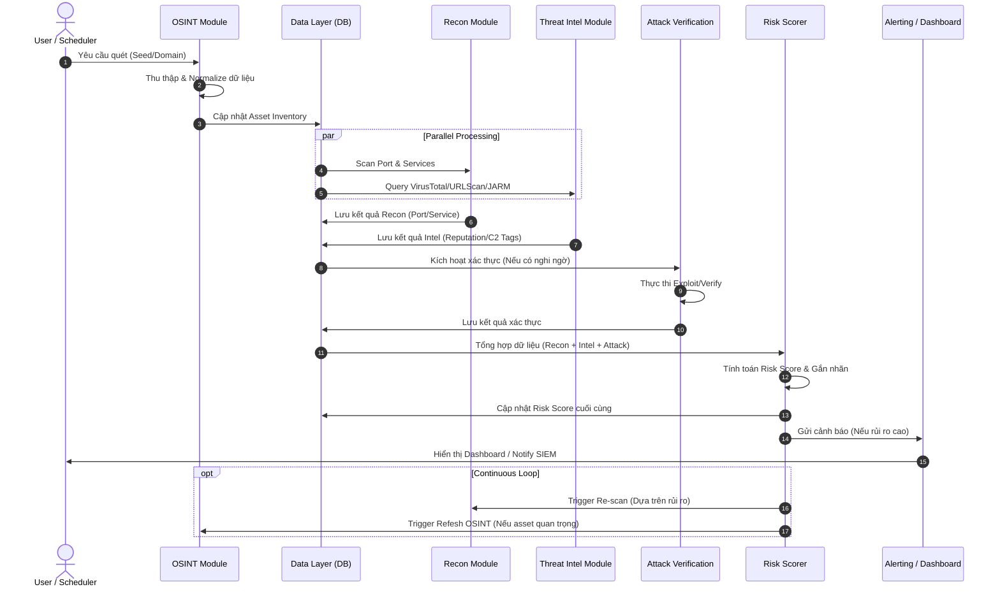

# ASM-Hawk Project Sequence Diagram

Sơ đồ trình tự thực thi giữa các hợp phần trong hệ thống ASM-Hawk.

## Giải thích luồng thực thi

1.  **Trigger:** Quy trình bắt đầu từ yêu cầu của người dùng hoặc lịch quét định kỳ.
2.  **Paralell (Xử lý song song):** Sau khi có danh sách tài sản từ OSINT, hệ thống đồng thời thực hiện quét kỹ thuật (Recon) và làm giàu dữ liệu từ bên ngoài (Threat Intel) để tối ưu thời gian.
3.  **Lớp dữ liệu (DB):** Đóng vai trò trung tâm để các module trao đổi thông tin và lưu trữ lịch sử.
4.  **Xác thực (Attack Verification):** Chỉ được kích hoạt cho các mục tiêu có dấu hiệu khả nghi từ kết quả Recon/TI để tiết kiệm tài nguyên.
5.  **Risk Scorer:** Là bước cuối cùng trước khi ra quyết định cảnh báo, đảm bảo các phát hiện được đối soát chéo (Correlate) từ nhiều nguồn.
