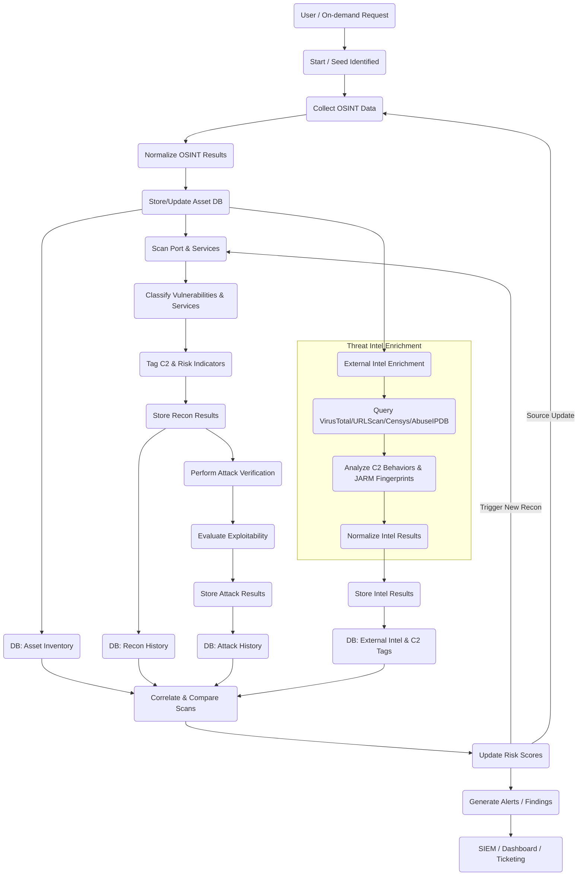
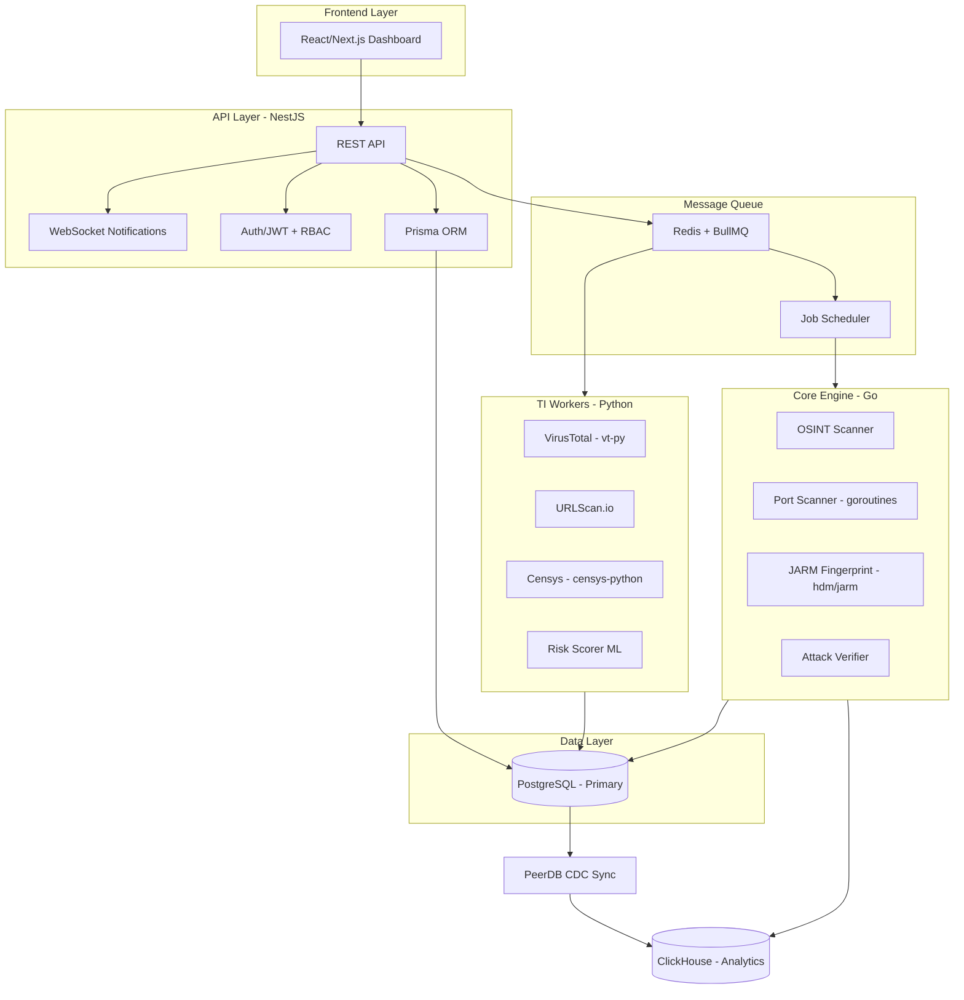

# ASM-Hawk Project Workflow

Luồng vận hành ASM tiêu chuẩn: Tự động hóa trinh sát, đối soát Threat Intel và xác thực rủi ro liên tục.

## 1. Sơ đồ quy trình (Mermaid Diagram)

## 2. Chi tiết các Module Tối ưu

### A. Threat Intel Enrichment (Module mới)
Module này chạy song song với Recon nội bộ để làm giàu thông tin về tài sản mà không cần tương tác trực tiếp:
*   **VirusTotal:** Kiểm tra độ danh tiếng (reputation), tỉ lệ detection và lịch sử liên kết với mã độc.
*   **URLScan.io:** Kiểm tra hành vi trang web, các lần redirect ẩn và chụp ảnh màn hình (screenshot) để nhận diện trang giả mạo (Phishing) hoặc C2 Panel.
*   **Censys/Shodan/JARM:** Sử dụng vân tay JARM để định danh các server C2 (như Cobalt Strike, Metasploit) ngay cả khi chúng cố tình ẩn mình hoặc thay đổi IP.

### B. Tối ưu hóa lưu trữ DB
Để tránh làm phình bảng Asset chính và hỗ trợ truy vấn lịch sử nhanh chóng, dữ liệu được chia tách:
1.  **Asset Inventory:** Lưu thông tin gốc (Domain, IP, IP Owner).
2.  **External Intel:** Lưu trữ dữ liệu thô (JSON) từ các API TI. Có cơ chế **Caching 24h** để tiết kiệm chi phí/limit API.
3.  **Risk Tags:** Lưu các marker cụ thể như `C2-Suspected`, `JARM-Match-CobaltStrike`, `High-Abuse-Report`.

### C. Quy trình Xác thực C2 (C2 Verification)
Hệ thống sử dụng cơ chế **Correlate (Đối soát chéo)**:
*   Nếu `Port Scan` thấy port lạ (ví dụ: 50050) + `JARM` khớp với Cobalt Strike + `VirusTotal` báo Malicious -> Tự động gắn nhãn **Confirmed C2** và đẩy cảnh báo mức **Critical**.
*   Các trường hợp còn lại sẽ được đưa vào hàng đợi `Attack Verification` để kiểm tra độ sâu hơn.

## 3. Vòng lặp liên tục
*   Tự động kích hoạt lại OSINT khi có sự thay đổi về dải IP hoặc tên miền con mới.
*   Tự động điều chỉnh tần suất quét (Frequency) dựa trên `Risk Score`: Tài sản có điểm rủi ro cao sẽ được Enrichment và Recon thường xuyên hơn.

## 4. Hybrid Scan

### Sơ đồ Kiến trúc Hệ thống

