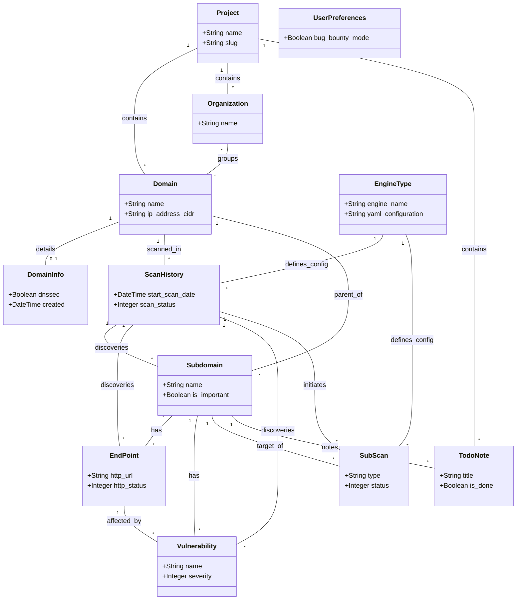

# Rengine Database Schema Documentation

This document provides an overview of the database schema for the Rengine project. The database is managed using Django ORM and is divided into several applications, each responsible for specific domains of the system.

## Module Overview

### 1. Dashboard (`web/dashboard/models.py`)
Handles high-level organizational structures and system-wide settings.
- **Project**: The top-level container for all reconnaissance data.
- **API Keys**: Stores keys for external services (OpenAI, Netlas, Chaos, HackerOne).
- **Notifications**: Manages in-app notifications.

### 2. Target App (`web/targetApp/models.py`)
Manages the targets (Domains) and their metadata.
- **Domain**: Represents a target domain (e.g., `example.com`). Linked to a Project.
- **Organization**: Groups domains together.
- **DomainInfo**: Stores WHOIS data, DNS records, and registrar information.

### 3. Scan Engine (`web/scanEngine/models.py`)
Defines how scans are executed.
- **EngineType**: Defines a scan engine (collection of tools and configurations).
- **InstalledExternalTool**: Manages external tools (Nuclei, Amass, etc.).
- **Configuration**: Stores scan configurations.

### 4. Start Scan (`web/startScan/models.py`)
Stores the results of scans.
- **ScanHistory**: A record of a specific scan execution.
- **Subdomain**: Discovered subdomains.
- **EndPoint**: Discovered HTTP endpoints (URLs).
- **Vulnerability**: Discovered vulnerabilities.
- **SubScan**: A smaller scan potentially targeting specific subdomains.

### 5. Recon Note (`web/recon_note/models.py`)
- **TodoNote**: Simple to-do items linked to subdomains and projects.

---

## Entity Relationship Diagram (Mermaid)

The following diagram illustrates the relationships between the core models.

