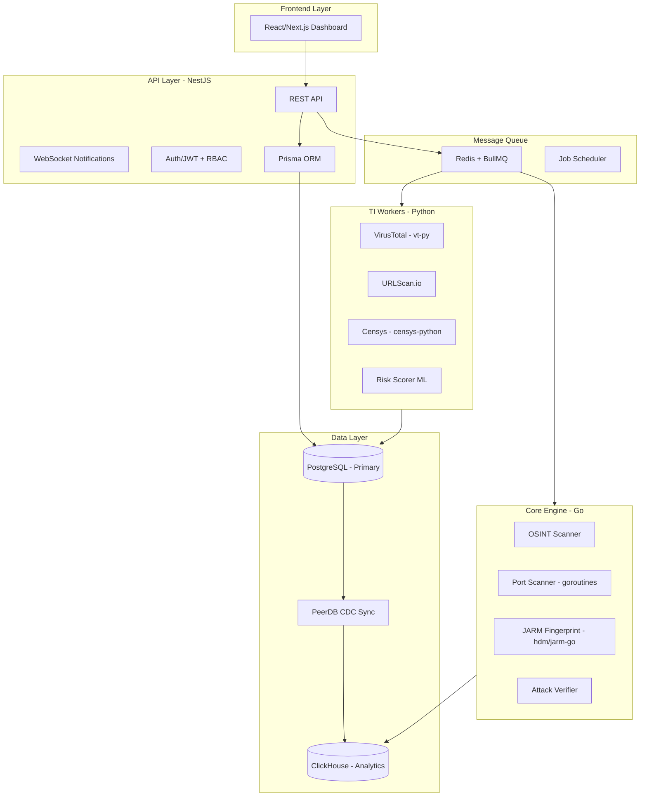

# 02 - System Architecture

## Hybrid Architecture



---

## Inter-Service Communication

| Pattern | Protocol | Use Case |
|---------|----------|----------|
| API → Workers | Redis Queue (BullMQ) | Async job scheduling |
| Workers → API | Redis Pub/Sub | Real-time notifications |
| Go ↔ NestJS | gRPC (optional) | High-perf sync calls |
| PostgreSQL → ClickHouse | CDC (PeerDB) | Real-time data sync |

---

## Key Libraries

| Component | Library | Purpose |
|-----------|---------|---------|
| Go Port Scanner | `gopacket`, `net` | SYN/TCP scans |
| Go JARM | `hdm/jarm-go` | TLS fingerprinting |
| Python TI | `vt-py`, `censys-python` | API clients |
| DB Sync | PeerDB / ClickPipes | CDC replication |
| Job Queue | BullMQ (NestJS) | Reliable job management |

---

## Project Structure

```
asm-hawk/
├── server/                     # NestJS API Server
│   ├── src/
│   │   ├── app.module.ts
│   │   ├── main.ts
│   │   ├── modules/
│   │   │   ├── auth/           # JWT + RBAC
│   │   │   ├── users/          # User management
│   │   │   ├── assets/         # Asset CRUD
│   │   │   ├── scans/          # Scan orchestration
│   │   │   ├── alerts/         # Alert management
│   │   │   └── dashboard/      # Analytics endpoints
│   │   ├── jobs/               # BullMQ job processors
│   │   │   ├── scan.processor.ts
│   │   │   └── intel.processor.ts
│   │   ├── common/             # Shared utilities
│   │   │   ├── guards/
│   │   │   ├── decorators/
│   │   │   └── filters/
│   │   └── config/             # App configuration
│   ├── prisma/
│   │   ├── schema.prisma       # DB schema
│   │   └── migrations/
│   ├── test/
│   ├── package.json
│   └── tsconfig.json
│
├── recon/                    # [NEW] Go Core Engine
│   ├── cmd/
│   │   └── recon/
│   │       └── main.go
│   ├── internal/
│   │   ├── osint/              # Subdomain enum
│   │   ├── portscan/           # Port scanner
│   │   ├── jarm/               # JARM fingerprint
│   │   ├── attack/             # Attack verification
│   │   └── queue/              # Redis queue client
│   ├── pkg/                    # Reusable packages
│   ├── go.mod
│   └── go.sum
│
├── workers/                    # [NEW] Python TI Workers
│   ├── src/
│   │   ├── virustotal/
│   │   │   └── worker.py
│   │   ├── urlscan/
│   │   │   └── worker.py
│   │   ├── censys/
│   │   │   └── worker.py
│   │   ├── risk_scorer/        # ML model
│   │   │   └── scorer.py
│   │   └── common/
│   │       └── queue.py        # Redis queue client
│   ├── tests/
│   ├── requirements.txt
│   └── pyproject.toml
│
├── web/                        # React/Next.js Frontend
│   ├── src/
│   │   ├── app/                # Next.js App Router
│   │   ├── components/
│   │   ├── lib/
│   │   ├── hooks/
│   │   └── styles/
│   ├── public/
│   ├── package.json
│   └── next.config.js
│
├── nginx/                      # Reverse Proxy
│   ├── nginx.conf
│   └── conf.d/
│       └── default.conf
│
├── redis/                      # Redis Config
│   └── redis.conf
│
├── docker/                     # [NEW] Docker configs
│   ├── server.Dockerfile
│   ├── recon.Dockerfile
│   ├── workers.Dockerfile
│   └── web.Dockerfile
│
├── docs/                       # Documentation
│   ├── Architecture.md
│   ├── Database.md
│   ├── Workflow.md
│   └── Sequence.md
│
├── .github/                    # [NEW] CI/CD
│   └── workflows/
│       └── ci.yml
│
├── docker-compose.yml          # [NEW] Local dev
├── docker-compose.prod.yml     # [NEW] Production
├── .env.example                # [NEW] Environment template
├── .gitignore
└── README.md
```