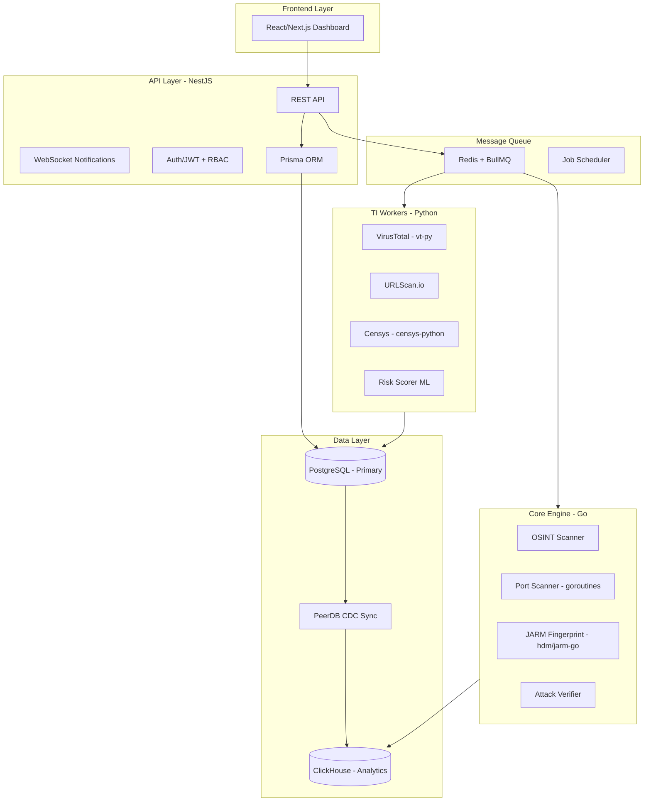

# 02 - System Architecture

## Hybrid Architecture



---

## Inter-Service Communication

| Pattern | Protocol | Use Case |
|---------|----------|----------|
| API → Workers | Redis Queue (BullMQ) | Async job scheduling |
| Workers → API | Redis Pub/Sub | Real-time notifications |
| Go ↔ NestJS | gRPC (optional) | High-perf sync calls |
| PostgreSQL → ClickHouse | CDC (PeerDB) | Real-time data sync |

---

## Key Libraries

| Component | Library | Purpose |
|-----------|---------|---------|
| Go Port Scanner | `gopacket`, `net` | SYN/TCP scans |
| Go JARM | `hdm/jarm-go` | TLS fingerprinting |
| Python TI | `vt-py`, `censys-python` | API clients |
| DB Sync | PeerDB / ClickPipes | CDC replication |
| Job Queue | BullMQ (NestJS) | Reliable job management |

---

## Project Structure

```
asm-hawk/
├── api/                    # NestJS API Server
│   ├── src/
│   │   ├── modules/
│   │   │   ├── auth/       # JWT + RBAC
│   │   │   ├── users/      # User management
│   │   │   ├── assets/     # Asset CRUD
│   │   │   ├── scans/      # Scan orchestration
│   │   │   ├── alerts/     # Alert management
│   │   │   └── dashboard/  # Analytics endpoints
│   │   ├── jobs/           # BullMQ processors
│   │   └── prisma/         # DB service
│   ├── prisma/schema.prisma
│   └── package.json
│
├── scanner/                # Go Core Engine
│   ├── cmd/scanner/main.go
│   ├── internal/
│   │   ├── osint/
│   │   ├── portscan/
│   │   ├── jarm/
│   │   ├── attack/
│   │   └── queue/
│   └── go.mod
│
├── workers/                # Python TI Workers
│   ├── src/
│   │   ├── virustotal/
│   │   ├── urlscan/
│   │   ├── censys/
│   │   ├── risk_scorer/
│   │   └── common/
│   └── requirements.txt
│
├── web/                    # React/Next.js Frontend
│   └── src/
│
├── docker/                 # Dockerfiles
├── nginx/                  # Reverse proxy
├── redis/                  # Redis config
└── docs/                   # Documentation
```
